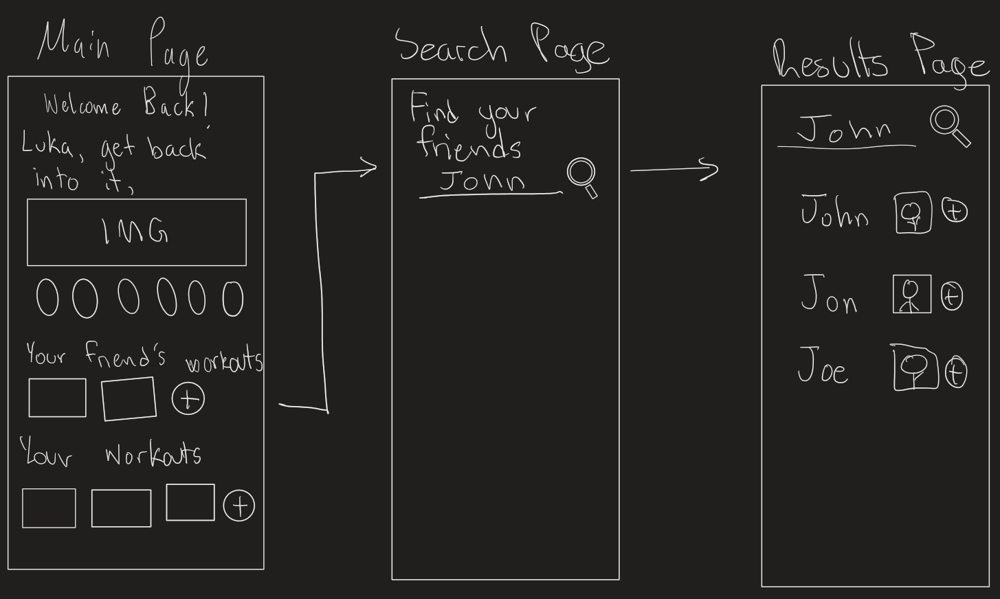

| SEG 4105  | Laboratory 4                                                                       |
| --------- | ---------------------------------------------------------------------------------- |
| Student   | Luka David, 300134324, ldavi029@uottawa.ca                                         |
| TA        | Shabnam Hassaniahari, shass126@uottawa.ca   Ali Mirferdos , smirf045@uottawa.ca |
| Professor | Andrew Forward, aforward@hey.com                                                   |
| Course    | Software Project Management, Fall 2023                                             |

## Feature - Social Interaction

This feature represents how users will interact by way of following one another. This will be initiated when users decide to follow each other accessed through the search page, they will then be able to see each other's workouts and routines (If they choose to make this data visible). Lastly they will be able to add their friends workouts to their own account for personal use.

## Breadboarding

### Social Feature

## Shaping Work

### Problem

One of the hardest challenges of a healthy lifestyle is having regular activity on a week to week basis. Most people struggle to find motivation to be active or lack the knowledge of what to do. It is difficult to hold yourself accountable, and most people don't want to invest the resources to have someone teach them the basics of exercising on a regular basis.

### Appetite

This feature needs to be completed within 4 weeks and should enable access for searching the database of users with the option of following accounts of choice. The search page needs to be simple enough to provide the user with a quick and easy method to find their friends. They will also be able to access who they follow and who follows them on another page. This feature needs to be implemented within the frontend and backend of our FitShare application.

### Solution

Users should be able to view their friends accounts who are public through a search page and be able to follow them in one click. Once they are followed if the user has visible workouts or routines, they should be accessible to all of their followers. They should also be able to save their friends routines and workouts to their own account. Lastly, they should be able to view all their friends and followers within their account page.

### Rabbit Holes

It is important that the search results can easily provide accounts that the users are searching for. They should not be too strict or too loose. Also, there should not be difficult backend logic considered when following or receiving followers. Both aspects of the feature should be simple for the user and relatively simple to implement.

### No Go's

Incorrect search results as well as bugs with following users will create significant issues for our application and would be considered incredibly detrimental.
