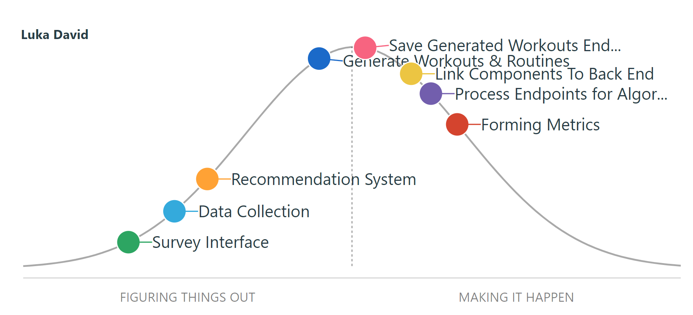

| SEG 4105  | Laboratory 6                                                                       |
| --------- | ---------------------------------------------------------------------------------- |
| Student   | Luka David, 300134324, ldavi029@uottawa.ca                                         |
| TA        | Shabnam Hassaniahari, shass126@uottawa.ca <br> Ali Mirferdos , smirf045@uottawa.ca |
| Professor | Andrew Forward, aforward@hey.com                                                   |
| Course    | Software Project Management, Fall 2023                                             |

## Feature - Workout Generation

Our feature was adding a survey to provide generate workouts for user. It can be broken down into the following scope elements:

- Endpoints
- Data Collection
- Algorithm
- UI
- Survey

The feature I will be working on will be the endpoints that need to be created for the algorithm to work.

## Basecamp Hill Chart Items


## Written To-Do Items

(Broken down to better indicate progress for other team members)

Save Generated Workouts Endpoints

- Create endpoint to receive inputs from algorithm
- Save information from endpoint to database
- Create Postman and Swagger calls
- Test Endpoint with dummy data

Here is an example of the endpoint that needs to be tested, updated and used:

```export async function getUserExercises(req: Request, res: Response) {
let userID: mongoose.Types.ObjectId;

try {
userID = new mongoose.Types.ObjectId(req.params.id);
const fitness = await Fitness.findById(userID);

    if (!fitness) {
      return res.status(404).json({ message: "User Fitness ID not found" });
    }

    return res.status(200).json(fitness.Exercises);

} catch (error) {
console.log("An error occurred getting the exercises " + error);
return res
.status(500)
.json({ message: "An error occured when fetching exercises" });
}

```

Process Endpoints for Algorithm

- Create endpoint to pass exercises to algorithm
- Add test calls to Postman and Swagger
- Test endpoints using different inputs

Here is an example of an endpoint to create an exercise that needs to be updated, tested and used.

```
export async function createWorkout(req: Request, res: Response) {
  let userID: mongoose.Types.ObjectId;
  let tempExerciseID: mongoose.Types.ObjectId;

  try {
    userID = new mongoose.Types.ObjectId(req.params.id);
  } catch (error) {
    return res.status(400).json({ message: "Invalid user ID" });
  }

  if(req.body.id == null){
    tempExerciseID = new Types.ObjectId();
  }
  else{
    tempExerciseID =  new mongoose.Types.ObjectId(req.body.id);
  }

  try {
    const newWorkout: IWorkout = {
      _id: tempExerciseID,
      name: req.body.name,
      exercises: req.body.exercises,
      visibility: req.body.visibility,
    };

    // add new workout to UserFitness collection
    userID = new mongoose.Types.ObjectId(req.params.id);
    await Fitness.updateOne(
      {
        _id: userID,
      },
      {
        $push: {
          Workouts: newWorkout,
        },
      }
    );

    return res.status(201).json({ message: "Workout created successfully" });
  } catch (error) {
    console.log("An error occurred creating the exercise. " + error);
    return res.status(500).json({message : "Internal server error"});
  }
```

## Plotted points on our Hill Chart

Pink and purple are plotted for my two points.



## Complete Hill Chart with our Group Members Updates


```

```
