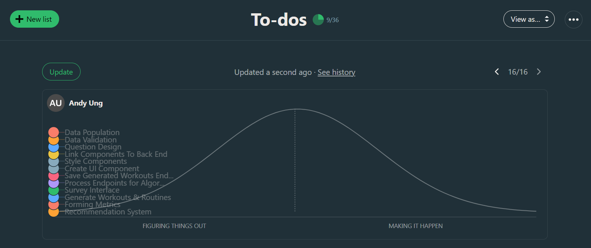
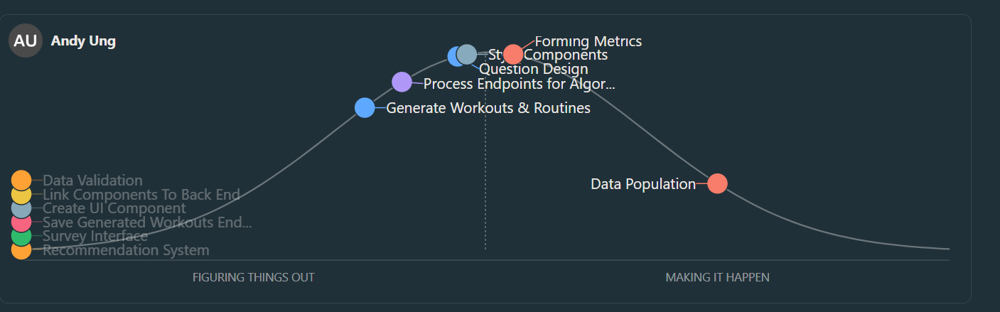
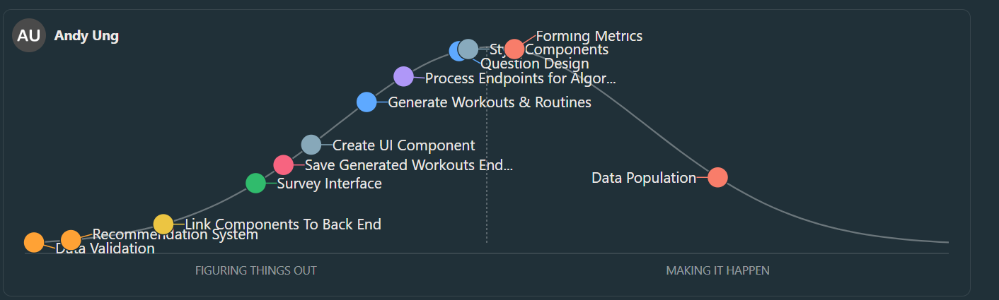
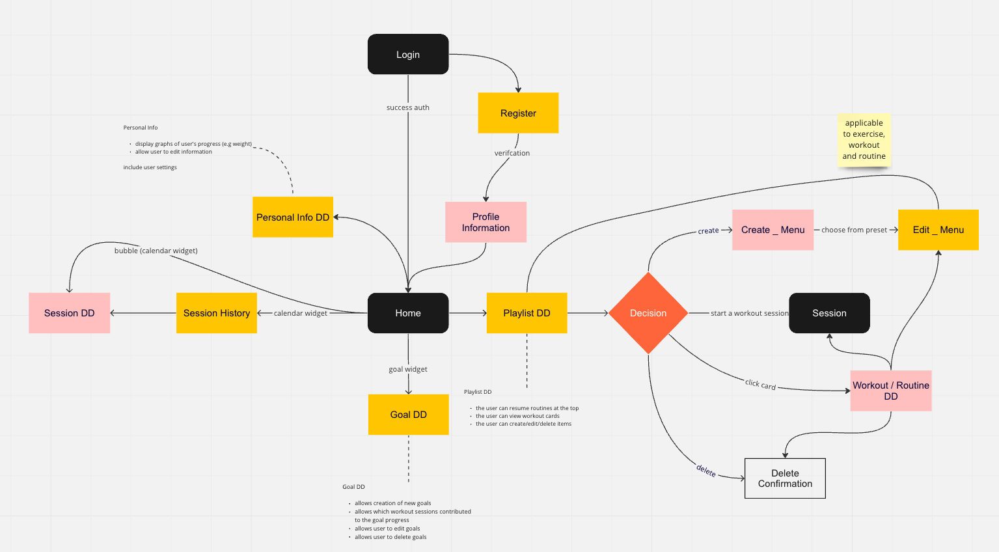
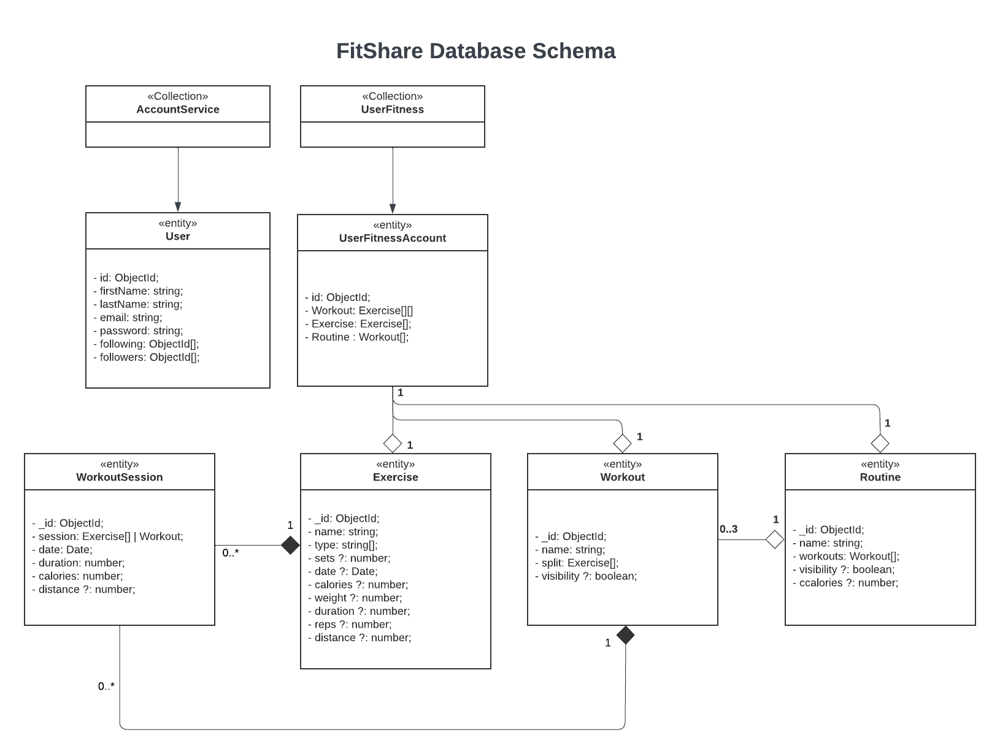
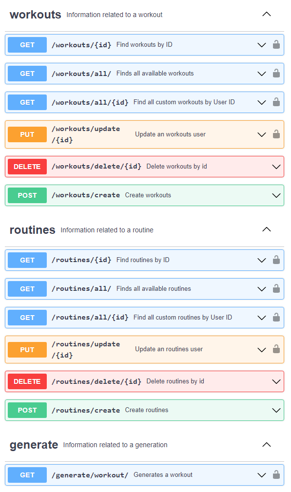
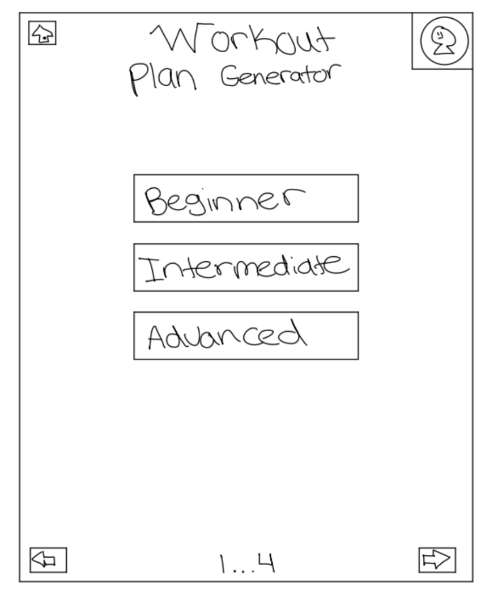
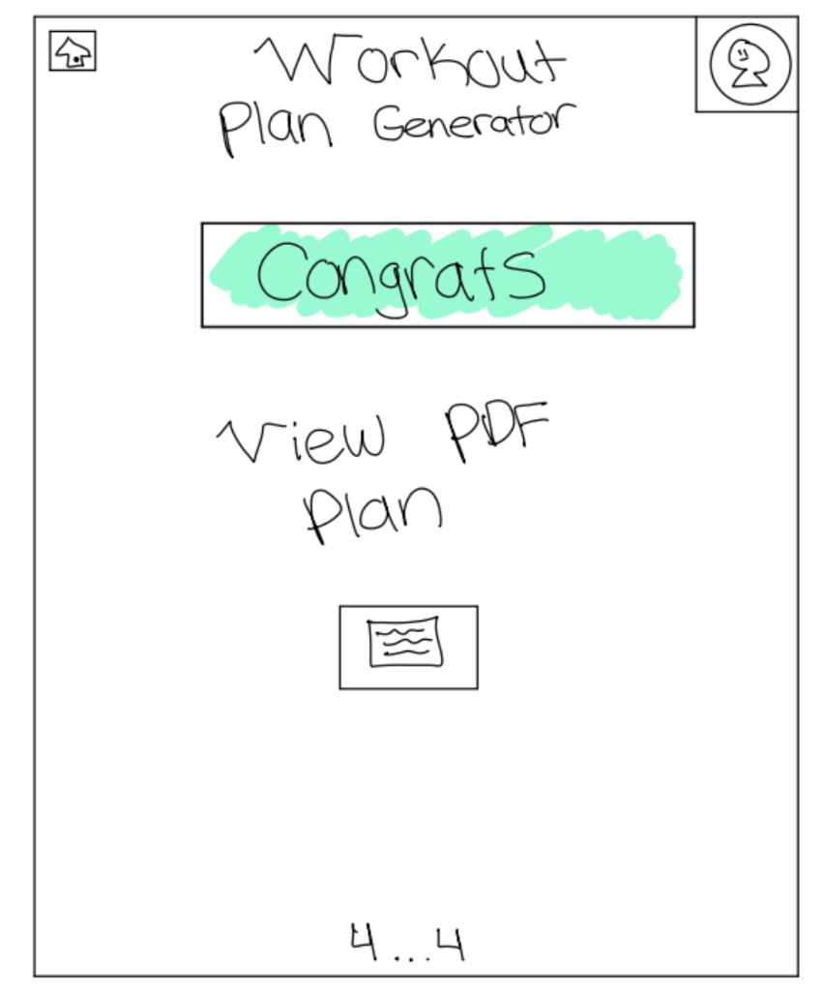
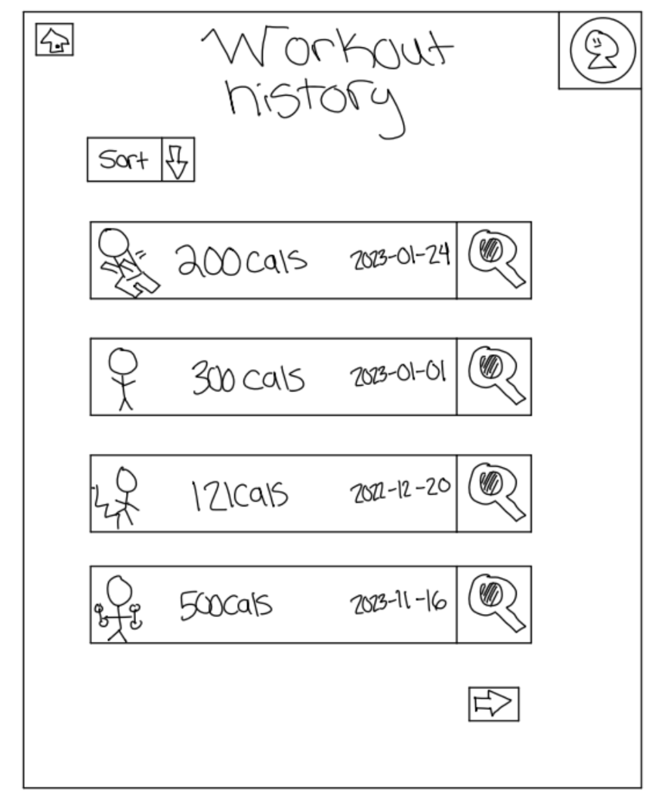

| SEG 4105  | Laboratory 7                                                                       |
| --------- | ---------------------------------------------------------------------------------- |
| Student   | Luka David, 300134324, ldavi029@uottawa.ca                                         |
| TA        | Shabnam Hassaniahari, shass126@uottawa.ca   Ali Mirferdos , smirf045@uottawa.ca |
| Professor | Andrew Forward, aforward@hey.com                                                   |
| Course    | Software Project Management, Fall 2023                                             |

### Scheduled Meetings For the Future

We will be meeting mainly on Tuesdays and Thursdays, with exception to some Saturdays if more time is needed.

Next Meeting (Tuesday, November 7th) on Discord:

- Revision
- Design Review
- Progression
  - UI (Ava)
  - Endpoint (Luka)
  - Survey (Adhish)
  - Generation (Andy)
- Additional questions for progress on Frontend
- Planning for next meeting includind deadlines, calendar updates, etc

Following Meeting (Thusday, November 9th) on Discord

Following Meeting (Tuesday, November 14th) on Discord

## My Updates and Progress

Updates regarding endpoints:

- There needs to be a seperation for the scope of the endpoints
  - There needs to be an endpoint to pass in the exercises for the algorithm to create exercises from
  - What needs to be finished:
    - Testing the endpoint
    - Ensuring the data is accurate and populated enough to provide variation
    - Add calls to swagger and Postman for testing
  - There needs to be an endpoint to then save the generated workouts or routines to a users account
  - What needs to be finished:
    - Ensuring the previous iteration of the endpoint is complete
    - Testing the endpoint with data created by the algorithm
    - Adding calls to easily test the information
    - working with Andy to see if anything additionally needs to be added

## Completed pull requestions

This can be added once the design is finished, as we need to have a meeting to confirm the design changes

## Meeting Minutes

### Luka (Endpoints):

- Save Generated Workouts Endpoints: Drafted / Created endpoint for saving workouts / routine endpoint, May need to adjust this after the algorithm been implemented to make sure it works properly, Will work on this once more progress is done on the process endpoint list / when Andy finishes the algorithm portion
- Process Endpoints for Algorithm: Created workout endpoint to accept input from front-end page to the send to the algorithm, Created swagger documentation of endpoint to better describe and allow for testing, Some manual / automated testing will be needed using Postman / other javascript testing frameworks to validate, With some sort of reworking / adding extra validations in the status code being recieved back after a request has been made

### Andy (Algorithm):

- Generate Workouts & Routines: Planned the flow of the algorithm of how it will intepret the inputs to then form a decision, Some more work that needs to be done on what methods mongodb will need to be incoperated, For later, once a rough draft of the algorithm has been made, a design and flow meeting will be held,
  Recommendation System: Recommendation system will come after the generate workouts and routines part of the algorithm has finished, Most likely will use the logic of the other algorithm to form the basis of the recommendation system
- Forming Metrics: Created a set of rules for how to interpret data / choices, Established values / points for metrics, Revisions for metrics are needed to finalize how to intrepret data, Seperate design meeting will take place later with Khai

### Adhish (Survey):

- Connection: Planned where the workout generation should be available / accessible to the overall domain of the FitShare application, Planned what the mini component would look like to access the Workout Generation page, Creation of the component will come a bit later / next
- Results
  - Planned how the results page will link to the overall FitShare application, Created mock-ups of how the result page would look like to the user from workout generation, Will need a future meeting to discuss this
- Accessibility: Thought of design considerations for the accessibility side of the workout generation, In collaboration with Avaneesh to better make sure the UI takes them into mind, Looking into some libraries that better illustrate these QOL for the application

### Avaneesh (UI):

- Create UI Components: After the design meeting, revisions to the mockups will happen -> then the creation of the components based off the designs
- Style Components: Created mock ups on how the survey should look / function (interactions), Design / revision meeting will happen to go over what needs to be changed or added, Will use the existing styling of the FitShare application to make the survey more uniformly connected, Connected to creating the components so won't be resuming for a while, Link Components to Back End
- This task will resume (on-hold) when the front-end is completed to allow for @LukaDavid04 to end-to-end test the inputs to the processing of information of the API

### Khai (Data Collection):

- Data Population: Previously researched example template workouts for generics that users could save, Finalized last minute additions and modifications to schemas reflecting the data that will be present in the database for the workout generation algorithm, Populated data within the database for mock exercises, workouts, and routines, Will need to add more data to the database (can be done at any stage of development)
- Question Design:
  - Reserached the market for the types of questions universely asked
    - Gathering an idea as to the necessary questions that gain enough information
    - Accumulated a set of criteria on the types of questions that are going to be asked during the survey
    - In colaboration with @andyung17 to determine what some of the necessities for the algorithm logic
  - Drafted initial set of questions that would be incoperated within the FitShare applications survey component
  - Will need to do some more work on refining the current set of questions and a review session with @andyung17 at a later point
- Data Validation:
  - This will get completed at a later date when the algorithm component is completed or in its first implementation phase

## Basecamp

### Week 1 (Original Start) - Planning Phase

### Week 2 (2023-10-23) - Break Period

### Week 3 (2023-11-03) - Acting Phase

### Important Documents

#### Flow to help plan placement of workout generation

#### Schema design for data storage

#### Swagger Documentation

#### Rough Designs

