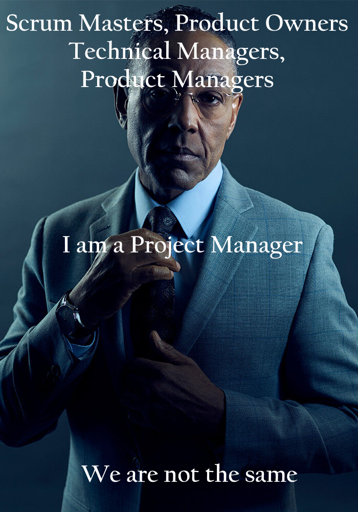

# Tutorial One: Meme/Blogpost
## Luka David, Student Number 300134324

## Meme

## Background information

There are many different titles used among different project management methods. Most people are used to having scrum masters and project managers within agile and waterfall methodologies. In my previous co-op terms I have even worked with technical managers or technical project managers. There can be a lot of confusion between the roles and responsibilties of the different parties. In this course we will be discussing mainly project managers. Scrum masters typically lead the scum sessions and provide organization to team meetings. They can also be useful for equally distributing the work within teams or ensuring teams are focused on the correct priorities. Technical project managers are typically reviewing and ensuring completed work follows the standards outlined. Product managers are typically confused with project managers the most, as they are more focused on managing the product rather then the people or the organization of people and their work.

## Resources Used
- https://www.smartsheet.com/content/software-project-management
- https://project-management.com/project-manager-roles-responsibilities-software-projects/
- https://www.wrike.com/project-management-guide/faq/what-is-software-project-management/
- https://www.coursera.org/articles/product-manager-vs-project-manager