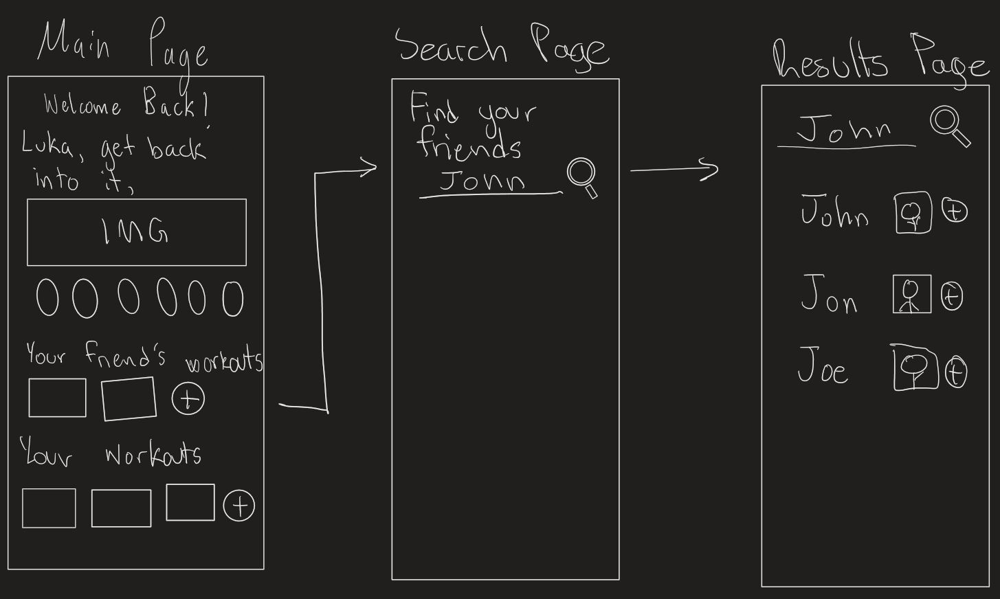

| SEG 4105  | Tutorial 5                                                                         |
| --------- | ---------------------------------------------------------------------------------- |
| Student   | Luka David, 300134324, ldavi029@uottawa.ca                                         |
| TA        | Shabnam Hassaniahari, shass126@uottawa.ca   Ali Mirferdos , smirf045@uottawa.ca |
| Professor | Andrew Forward, aforward@hey.com                                                   |
| Course    | Software Project Management, Fall 2023                                             |

## FitShare - Overview

We want to create a gym web-application for those who are looking to start working out or share their own workouts. The application will function similar to how spotify users share playlists of their songs. Users will be able to follow their friends or other creators and view the various exercises within their workouts. Within the application, each workout will track the reps and sets of the different exercises. Over time users will be able to see their improvements such a new personal records or goals that have been accomplished. Workouts will also provide information such as the number of calories that have been burned. Exercises will also have a visual demonstration to ensure the client is following proper form. The product will be targeting all levels of fitness knowledge.

## Planning

### Location (Betting and Kick-Off)

Meeting will take place over discord, in a voice call where people will have the ability to share their screen.

### Time

Betting will take place on Thursday, October 12th at 2:00 PM ET. Kick-off will take place on Thursday, October 19th.

### Expectation

All participants need a prepared pitch, as well as notes on each other members pitch. They need to be prepared to ask questions and pick a winning pitch.

## Feature - Social Interaction

This feature represents how users will interact by way of following one another. This will be initiated when users decide to follow each other accessed through the search page, they will then be able to see each other's workouts and routines (If they choose to make this data visible). Lastly they will be able to add their friends workouts to their own account for personal use.

## Pitch

One of the hardest challenges of a healthy lifestyle is having regular activity on a week to week basis. Most people struggle to find motivation to be active or lack the knowledge of what to do. It is difficult to hold yourself accountable, and most people don't want to invest the resources to have someone teach them the basics of exercising on a regular basis.

This feature needs to be completed within 4 weeks and should enable access for searching the database of users with the option of following accounts of choice. The search page needs to be simple enough to provide the user with a quick and easy method to find their friends. They will also be able to access who they follow and who follows them on another page. This feature needs to be implemented within the frontend and backend of our FitShare application.

Users should be able to view their friends accounts who are public through a search page and be able to follow them in one click. Once they are followed if the user has visible workouts or routines, they should be accessible to all of their followers. They should also be able to save their friends routines and workouts to their own account. Lastly, they should be able to view all their friends and followers within their account page.

It is important that the search results can easily provide accounts that the users are searching for. They should not be too strict or too loose. Time and resources should not be spent on adding additional features such as editing other people's workouts. Simply saving a workout to your own account will encompass the basic social aspects within this feature. Also, there should not be difficult backend logic considered when following or receiving followers. Both aspects of the feature should be simple for the user and relatively simple to implement.

Incorrect search results as well as bugs with following users will create significant issues for our application and would be considered incredibly detrimental. The following and follower mechanics should be well tested to prevent such issues. Also keeping private users data private, is a critically important aspect of this feature. If any unwanted data is made public it could be seriously detrimental for the project.

## Notes

### Andy - Workout Generation

- Workout generation is a solution for people with little knowledge of the physical activity space
- Can create based on a survey from user input
- Will require an algorithm to generate the workouts, based of exercises within a database
  - Workout information will not be saved

### Khai - Sessions

- Sessions is a solution for users to interact with the application and easily follow workout
- This will be a UI that prompts the user with exercises they then scroll through
- Information will be tracked in real time, passing into the database
- The idea is that the data can also be more easily or accurately stored

### Avaneesh - Log in

- Sign up or log in is a solution to individualize accounts to store information for workouts
- It's a fairly commmon feature that is standard among projects, howevever it is not as easy to implement
- One of the main difficulties will be saving and storing the data and making sure authentication is secure
-

### Adhish - Calendar

- Calendar is a solution that implements tracking data through dates
- This will allow information to be stored in a history like aspect for easy access and reuse
- This ties into features such as strat tracking as you can view progress with the new data being tracked over time
- this is mainly a challenge for the frontend as many pages are needed for saving workouts, selecting dates etc

## Questions

To be added.

## Group Members and Resources

|       Name        |        Email        | Student Number |       Current Role        |
| :---------------: | :-----------------: | :------------: | :-----------------------: |
|     Andy Ung      | aung015@uottawa.ca  |   300117710    |     Business Analyst      |
|    Luka David     | ldavi029@uottawa.ca |   300134324    |      Project Manager      |
|     Khai Tran     | ktran093@uottawa.ca |   300112587    |         Architect         |
| Avaneesh Madaram  | amada034@uottawa.ca |   300130329    |      Lead Developer       |
| Adhish Maheswaran | amahe023@uottawa.ca |   300133918    | Quality Assurance Manager |

- Andy: https://github.com/andyung17/seg4105_playground/tree/main/lab03
- Khai : https://github.com/khaiqtran13/seg4105_playground/tree/main/lab03
- Luka: https://github.com/LukaDavid04/seg4105_playground/tree/del01
- Adhish: https://github.com/adhish2001/seg4105_playground/tree/main/deliverable01
- Ava: https://github.com/AvaneeshM/seg4105_playground/tree/main/lab03
